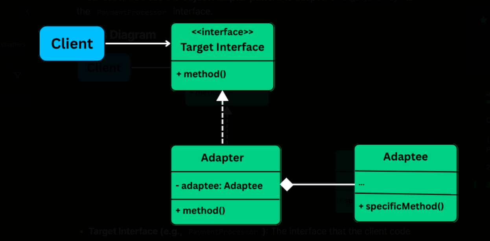

# 🧩 Adapter Design Pattern Demo (C# / .NET)
## 🌟 Overview

This project shows how the Adapter Design Pattern works in C#.
The Adapter pattern helps connect classes that don’t match — it acts like a bridge between two different systems so they can work together.

## 📘 What Is the Adapter Pattern?

The Adapter pattern converts one interface into another that the client expects.
It lets two classes with incompatible interfaces work together smoothly.

Think of it like a power adapter:
It lets your laptop charger (one type of plug) work with a different power socket.


## Use Case Scenario
This demo simulates a **Payment Processing System** where:
- We have a modern payment gateway interface (`IPaymentProcessor`)
- We need to integrate with legacy payment systems (Stripe, PayPal) that have different interfaces
- Adapters bridge the gap between our interface and the legacy systems
- Modern systems like Razorpay already implement our interface directly (no adapter needed)

## UML Diagram

```
┌─────────────────────┐
│      Client         │
│  (PaymentService)   │
└──────────┬──────────┘
           │ uses
           ▼
┌─────────────────────┐
│  <<interface>>      │
│  IPaymentProcessor  │
├─────────────────────┤
│ + ProcessPayment()  │
│ + RefundPayment()   │
└──────────┬──────────┘
           △
           │ implements
     ┌─────┼──────┬──────┐
     │     │      │      │
┌────┴────┐│ ┌───┴─────┐│
│ Stripe  ││ │ PayPal  ││
│ Adapter ││ │ Adapter ││
└────┬────┘│ └───┬─────┘│
     │     │     │      │
     │uses │uses │      │ directly implements
     ▼     │     ▼      ▼
┌─────────┐│┌──────────┐┌──────────┐
│ Stripe  │││ PayPal   ││ Razorpay │
│ Service │││ Service  ││ (Modern) │
│(Legacy) │││(Legacy)  ││          │
└─────────┘│└──────────┘└──────────┘
```

## Class Diagram

```
┌───────────────────────────────────┐
│      IPaymentProcessor            │
├───────────────────────────────────┤
│ + ProcessPayment(amount, card)    │
│ + RefundPayment(transactionId)    │
└───────────────────────────────────┘
                △
                │
        ┌───────┼───────┬────────────┐
        │       │       │            │
┌───────┴────────┐ ┌────┴──────────┐ │
│ StripeAdapter  │ │ PayPalAdapter │ │
├────────────────┤ ├───────────────┤ │
│ - stripeService│ │ - paypalApi   │ │
├────────────────┤ ├───────────────┤ │
│ + Process...() │ │ + Process...()│ │
│ + Refund...()  │ │ + Refund...() │ │
└────────┬───────┘ └───┬───────────┘ │
         │             │             │
         │             │             │
         ▼             ▼             ▼
┌────────────────┐ ┌──────────────┐ ┌──────────────┐
│ StripeService  │ │ PayPalApi    │ │  Razorpay    │
├────────────────┤ ├──────────────┤ ├──────────────┤
│ + Charge()     │ │ + SendMoney()│ │ + Process...()│
│ + Cancel()     │ │ + Void()     │ │ + Refund...() │
└────────────────┘ └──────────────┘ └──────────────┘
   (Legacy)           (Legacy)         (Modern - No
                                        adapter needed)
```

## Project Structure

```
AdapterPatternDemo/
├── README.md
├── Program.cs
├── Interfaces/
│   └── IPaymentProcessor.cs
├── LegacySystems/
│   ├── StripeService.cs
│   └── PayPalApi.cs
├── Adapters/
│   ├── StripeAdapter.cs
│   └── PayPalAdapter.cs
├── ModernPaymentSystem/
│   └── Razorpay.cs
└── Services/
    └── PaymentService.cs
```

## Key Components

### 1. Target Interface (IPaymentProcessor)
The interface that our client code expects and uses.

### 2. Adaptees (StripeService, PayPalApi)
Legacy services with incompatible interfaces that we want to integrate.

### 3. Adapters (StripeAdapter, PayPalAdapter)
Classes that implement the target interface and wrap the legacy services, translating calls between interfaces.

### 4. Modern Implementation (Razorpay)
A modern payment system that directly implements IPaymentProcessor - no adapter needed!

### 5. Client (PaymentService)
The service that uses the target interface without knowing about the legacy implementations or whether an adapter is being used.

## How to Run

1. Ensure you have .NET 6.0 or later installed
2. Navigate to the project directory
3. Run the following commands:

```bash
dotnet new console -n AdapterPatternDemo
cd AdapterPatternDemo
# Copy all source files to the project
dotnet run
```

## Expected Output

```
=== Payment Processing System ===

Processing payment with Stripe...
[Stripe] Charging $150.00 to card ending in 1234
[Stripe] Transaction ID: stripe_tx_abc123
Payment processed successfully!

Processing refund with Stripe...
[Stripe] Canceling transaction: stripe_tx_abc123
[Stripe] Refund completed
Refund processed successfully!

---

Processing payment with PayPal...
[PayPal] Sending $200.00 from card ending in 5678
[PayPal] Payment ID: paypal_pmt_xyz789
Payment processed successfully!

Processing refund with PayPal...
[PayPal] Voiding payment: paypal_pmt_xyz789
[PayPal] Refund issued
Refund processed successfully!

---

Processing payment with Razorpay...
[Razorpay] Processing payment of ₹3000.00 using card ending in 6666
[Razorpay] Transaction ID: razorpay_tx_def456
Payment processed successfully!

Processing refund with Razorpay...
[Razorpay] Refunding transaction: razorpay_tx_def456
[Razorpay] Refund completed
Refund processed successfully!

---

=== Demonstrating Polymorphism ===

Using Stripe processor through interface:
[Stripe] Charging $99.99 to card ending in 6666
Payment processed successfully!

Using PayPal processor through interface:
[PayPal] Sending $99.99 from card ending in 6666
Payment processed successfully!

Using Razorpay processor through interface:
[Razorpay] Processing payment of ₹99.99 using card ending in 6666
Payment processed successfully!
```

## Benefits of Adapter Pattern

1. **Single Responsibility**: Separates interface conversion logic from business logic
2. **Open/Closed Principle**: Add new adapters without modifying existing code
3. **Flexibility**: Work with incompatible interfaces seamlessly
4. **Reusability**: Adapters can be reused across different contexts
5. **Future-Proof**: New systems can implement the interface directly (like Razorpay) while legacy systems use adapters

## Real-World Applications

- Database drivers (ADO.NET adapters)
- Payment gateway integrations
- Third-party API integrations
- Legacy system modernization
- Cross-platform compatibility layers

## Related Patterns

- **Bridge Pattern**: Similar structure but different intent (abstraction vs adaptation)
- **Decorator Pattern**: Adds behavior; Adapter changes interface
- **Facade Pattern**: Simplifies interface; Adapter makes interfaces compatible