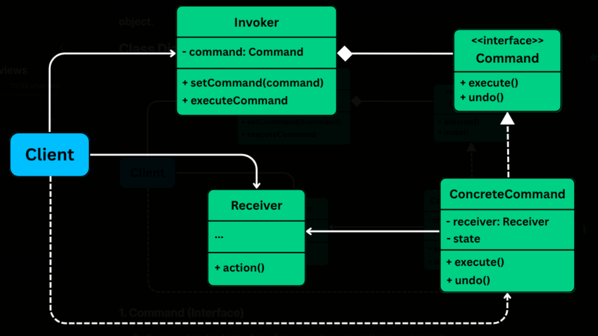

# Command Pattern - Simple Guide

## What is the Command Pattern?

The Command Pattern is a way to **wrap a request as an object**. Instead of calling a method directly, you create a command object that knows how to do the job. This makes your code more flexible and easier to manage.

Think of it like a restaurant:
- You (customer) don't go to the kitchen and cook
- You tell the waiter what you want
- The waiter writes it on an order slip (the command)
- The chef gets the order slip and cooks
- You can also cancel the order before it's cooked (undo!)

## Why Use Command Pattern?

✅ **Separate what to do from how to do it**  
✅ **Easy to add new commands without changing existing code**  
✅ **Support undo/redo operations**  
✅ **Queue or log commands for later**  
✅ **Build macro commands (multiple commands at once)**

## How It Works - Simple Diagram

```
┌─────────────┐
│   Client    │  (You - the person using the remote)
│  (Program)  │
└──────┬──────┘
       │ creates commands
       ▼
┌─────────────────┐
│ Remote Control  │  (The Invoker - stores and triggers commands)
│   (Invoker)     │
│                 │
│ [Button 1] ON   │──► LightOnCommand
│ [Button 1] OFF  │──► LightOffCommand
│ [Button 2] ON   │──► FanHighCommand
│ [UNDO Button]   │──► Undo last command
└─────────┬───────┘
          │ calls Execute()
          ▼
    ┌──────────┐
    │ ICommand │  (Command Interface)
    └──────────┘
          △
          │ implements
    ┌─────┴─────────────┐
    │                   │
┌───┴──────────┐  ┌────┴──────────┐
│LightOnCommand│  │ FanHighCommand│  (Concrete Commands)
└───┬──────────┘  └────┬──────────┘
    │ calls           │ calls
    ▼                 ▼
┌────────┐        ┌────────┐
│ Light  │        │  Fan   │  (Receivers - do the actual work)
└────────┘        └────────┘
```


## Generic Diagram of Command Pattern




## Project Structure Explained

### 1. **Command Interface (ICommand)**
```csharp
public interface ICommand
{
    void Execute();  // Do the action
    void Undo();     // Reverse the action
}
```
- This is the blueprint for all commands
- Every command must know how to Execute and Undo

### 2. **Receivers (Light, Fan)**
```csharp
public class Light
{
    public void On() { ... }   // Turn light on
    public void Off() { ... }  // Turn light off
}
```
- These are the actual devices
- They know how to do the real work
- The remote doesn't need to know HOW they work

### 3. **Concrete Commands (LightOnCommand, FanHighCommand, etc.)**
```csharp
public class LightOnCommand : ICommand
{
    private Light light;
    
    public void Execute() 
    { 
        light.On();  // Tell the light to turn on
    }
    
    public void Undo() 
    { 
        light.Off(); // Reverse by turning off
    }
}
```
- Each command wraps one specific action
- Knows which device to control
- Stores information needed for undo

### 4. **Invoker (RemoteControl)**
```csharp
public class RemoteControl
{
    private ICommand[] onCommands;
    private ICommand[] offCommands;
    
    public void OnButtonPressed(int slot)
    {
        onCommands[slot].Execute();
    }
}
```
- Stores all the commands
- Doesn't know what the commands do
- Just calls Execute() when button is pressed
- Keeps track of history for undo

### 5. **Client (Program/Main)**
```csharp
Light livingRoomLight = new Light("Living Room");
LightOnCommand lightOn = new LightOnCommand(livingRoomLight);
remote.SetCommand(0, lightOn, lightOff);
remote.OnButtonPressed(0);  // Execute!
```
- Sets up everything
- Creates receivers, commands, and remote
- Connects them together

## How the Pattern Works - Step by Step

### Example: Turning on a light

1. **Client** creates a Light object (receiver)
2. **Client** creates a LightOnCommand and gives it the Light
3. **Client** puts the command in the Remote Control (slot 0)
4. **User** presses button 0 on the remote
5. **Remote** calls `Execute()` on the command in slot 0
6. **LightOnCommand** calls `light.On()`
7. **Light** turns on!

### Undo Process:

1. **Remote** keeps a stack of executed commands
2. **User** presses UNDO button
3. **Remote** pops the last command from stack
4. **Remote** calls `Undo()` on that command
5. **Command** reverses its action
6. Light turns off!

## Flow Diagram

```
User Action          Remote Control         Command              Device
    |                      |                   |                    |
    |--[Press Button 0]--->|                   |                    |
    |                      |                   |                    |
    |                      |---Execute()------>|                    |
    |                      |                   |                    |
    |                      |                   |----light.On()----->|
    |                      |                   |                    |
    |                      |                   |                    |✓ Light ON
    |                      |                   |                    |
    |                      |<--[Save to stack]-|                    |
    |                      |                   |                    |
    |--[Press UNDO]------->|                   |                    |
    |                      |                   |                    |
    |                      |----Undo()-------->|                    |
    |                      |                   |                    |
    |                      |                   |---light.Off()----->|
    |                      |                   |                    |✓ Light OFF
```

## Key Benefits in This Project

### 1. **Easy to Add New Devices**
Want to add a TV? Just create:
- `TV` class (receiver)
- `TVOnCommand` and `TVOffCommand`
- No need to change RemoteControl!

### 2. **Undo is Built-in**
- Every command knows how to undo itself
- Remote just keeps a history stack
- Press undo, and it reverses the last action

### 3. **Flexible Control**
- You can put any command in any slot
- Swap commands around easily
- Create macro commands (multiple actions in one button)

### 4. **Loose Coupling**
- Remote doesn't know about Light or Fan
- It only knows about ICommand
- Easy to test and maintain

## Running the Project

1. Open in Visual Studio or your C# IDE
2. Run the program
3. Watch the output as commands execute
4. See how undo reverses actions

### Expected Output:
```
=== Command Pattern Demo - Home Automation ===

--- Testing Remote Control ---
Living Room light is ON
Living Room light is OFF

Bedroom light is ON
Living Room fan is on HIGH

--- Testing Undo ---
Living Room fan is OFF
Bedroom light is OFF
Living Room light is ON
```

## Try These Exercises

1. **Add a new device** (TV, Stereo, Garage Door)
2. **Create a macro command** that turns on multiple lights at once
3. **Add more fan speeds** (Low, Medium)
4. **Implement a "All Off" button** that turns everything off

## Real-World Uses

- **Text Editors**: Undo/Redo buttons
- **Games**: Action replay, save game states
- **Task Schedulers**: Queue jobs to run later
- **Transaction Systems**: Rollback operations
- **Smart Home Apps**: Automate device control

## Summary

The Command Pattern is like having a universal remote:
- Each button is a command object
- The remote doesn't care what devices you have
- You can add new devices anytime
- You can undo what you just did
- Everything is organized and flexible!

---

**Remember**: Commands are just objects that wrap actions. This simple idea makes complex systems much easier to build and maintain!