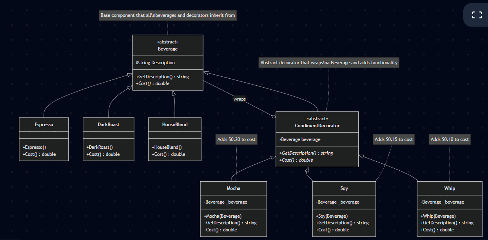

# Decorator Pattern - Complete Guide with Starbuzz Coffee Example

## Table of Contents
1. [What is the Decorator Pattern?](#what-is-the-decorator-pattern)
2. [The Problem We're Solving](#the-problem-were-solving)
3. [Understanding the Pattern](#understanding-the-pattern)
4. [Generic Decorator Pattern Structure](#generic-decorator-pattern-structure)
5. [Our Coffee Shop Implementation](#our-coffee-shop-implementation)
6. [Step-by-Step Program Flow](#step-by-step-program-flow)
7. [Complete Example Walkthrough](#complete-example-walkthrough)
8. [When Should You Use This Pattern?](#when-should-you-use-this-pattern)
9. [Real-World Examples](#real-world-examples)
10. [Advantages and Disadvantages](#advantages-and-disadvantages)
11. [How to Use This README on GitHub](#how-to-use-this-readme-on-github)

---

## What is the Decorator Pattern?

Imagine you have a plain coffee. Now you want to add milk to it. Then maybe sugar. Then maybe caramel. Each time you add something, you're "decorating" your coffee with new features, but it's still fundamentally a coffee.

**The Decorator Pattern** does the same thing with code. It lets you add new features or behaviors to objects by wrapping them in special "decorator" objects. Think of it like wrapping a gift - the gift stays the same, but you can add multiple layers of wrapping paper, ribbons, and bows.

### Simple Definition
> The Decorator Pattern attaches additional responsibilities to an object dynamically. Decorators provide a flexible alternative to subclassing for extending functionality.

### Key Points
- You can add features to objects **at runtime** (while the program is running)
- You don't change the original object's code
- You can stack multiple decorators on top of each other
- Each decorator adds one specific feature

---

## The Problem We're Solving

### Without the Decorator Pattern

Imagine you run a coffee shop with:
- 4 types of coffee: Espresso, DarkRoast, HouseBlend, Decaf
- 3 condiments: Milk, Soy, Mocha, Whip

If you wanted to create a class for every possible combination, you'd need:
- `Espresso`
- `EspressoWithMilk`
- `EspressoWithSoy`
- `EspressoWithMilkAndSoy`
- `EspressoWithMilkAndSoyAndMocha`
- ... and so on

**Total classes needed**: Hundreds! And what if you want double mocha? Even more classes!

### With the Decorator Pattern

You only need:
- 4 coffee classes (Espresso, DarkRoast, HouseBlend, Decaf)
- 4 condiment decorator classes (Milk, Soy, Mocha, Whip)

**Total**: Just 8 classes for infinite combinations! ??

---

## Understanding the Pattern

### The Core Idea

Think of Russian nesting dolls (Matryoshka dolls). Each doll contains another doll inside it. The Decorator Pattern works the same way:

```
???????????????????????????
?   Whip Decorator        ?  ? Outermost layer
?  ????????????????????   ?
?  ?  Mocha Decorator ?   ?  ? Middle layer
?  ?  ?????????????   ?   ?
?  ?  ?  Espresso ?   ?   ?  ? Core object
?  ?  ?????????????   ?   ?
?  ????????????????????   ?
???????????????????????????
```

Each layer:
1. **Wraps** the object inside it
2. **Adds** its own behavior
3. **Passes** requests to the wrapped object
4. Can **modify** the result before passing it back

---

## Generic Decorator Pattern Structure

Here's the general structure of the Decorator Pattern that applies to any situation:

### Generic UML Diagram

```
???????????????????????????????????????????????????????????????
?                     Component (abstract)                     ?
?  The base type that defines the interface                   ?
???????????????????????????????????????????????????????????????
?  + Operation(): ReturnType                                  ?
???????????????????????????????????????????????????????????????
                   ?
                   ? inherits
      ????????????????????????????
      ?                          ?
??????????????????????    ??????????????????????????????????
? ConcreteComponent  ?    ?   Decorator (abstract)         ?
?                    ?    ?   Also inherits from Component ?
??????????????????????    ??????????????????????????????????
? + Operation()      ?    ? - component: Component         ?
??????????????????????    ? + Operation()                  ?
                          ??????????????????????????????????
                                    ?
                                    ? inherits
                        ??????????????????????????
                        ?                        ?
              ????????????????????    ????????????????????
              ? ConcreteDecoratorA?    ? ConcreteDecoratorB?
              ?????????????????????    ?????????????????????
              ? + Operation()     ?    ? + Operation()     ?
              ?   {               ?    ?   {               ?
              ?    component.     ?    ?    component.     ?
              ?    Operation();   ?    ?    Operation();   ?
              ?    addBehavior(); ?    ?    addBehavior(); ?
              ?   }               ?    ?   }               ?
              ?????????????????????    ?????????????????????
```

### How the Generic Pattern Works

1. **Component**: The base interface that all objects follow
   - Defines what operations are available
   - Both real objects and decorators implement this

2. **ConcreteComponent**: The real object you want to decorate
   - The actual thing (like a plain coffee)
   - Implements the base operations

3. **Decorator**: The abstract wrapper class
   - Also inherits from Component (so it can substitute for the real object)
   - Holds a reference to a Component object
   - Delegates calls to the wrapped object

4. **ConcreteDecorator**: Specific decorators that add features
   - Wraps a Component
   - Calls the wrapped object's method
   - Adds its own behavior before or after

### Generic Code Flow

```
Client calls: decoratorB.Operation()
    ?
decoratorB.Operation() executes:
    ?
    calls: component.Operation()  ? This component is decoratorA
        ?
        decoratorA.Operation() executes:
            ?
            calls: component.Operation()  ? This component is concreteComponent
                ?
                concreteComponent.Operation() executes
                returns: base result
            ?
            adds decoratorA behavior
            returns: modified result
    ?
    adds decoratorB behavior
    returns: final result
```

---

## Our Coffee Shop Implementation

Now let's see how this generic pattern applies to our coffee shop:

### Coffee Shop Class Diagram
)


### The Components Explained

#### 1. Beverage (Component)
This is our base class. Every coffee and every condiment is a Beverage.

```csharp
public abstract class Beverage
{
    public string Description { get; protected set; }
    public abstract double Cost();
}
```

**Why?** This ensures everything has a description and a cost.

#### 2. Concrete Beverages (ConcreteComponent)
These are the actual coffees you can order:

```csharp
public class Espresso : Beverage
{
    public Espresso() { Description = "Espresso"; }
    public override double Cost() { return 1.99; }
}
```

**Why?** These are the "real" objects we want to decorate.

#### 3. CondimentDecorator (Decorator)
This is the abstract decorator that all condiments inherit from:

```csharp
public abstract class CondimentDecorator : Beverage
{
    public abstract override string GetDescription();
}
```

**Why?** It makes sure all decorators are also Beverages, so they can wrap each other.

#### 4. Concrete Decorators (ConcreteDecorator)
These are the actual condiments:

```csharp
public class Mocha : CondimentDecorator
{
    private readonly Beverage _beverage;  // ? The wrapped object
    
    public Mocha(Beverage beverage) 
    { 
        _beverage = beverage;  // ? Store the object we're wrapping
    }
    
    public override double Cost() 
    { 
        return _beverage.Cost() + 0.20;  // ? Add our cost to wrapped object's cost
    }
}
```

**Why?** Each condiment wraps a beverage and adds its own price and description.

---

## Step-by-Step Program Flow

Let's trace exactly what happens when we create this order:

```csharp
Beverage beverage2 = new DarkRoast();
beverage2 = new Mocha(beverage2);
beverage2 = new Mocha(beverage2);
beverage2 = new Whip(beverage2);
```

### Step 1: Create the Base Coffee

```csharp
Beverage beverage2 = new DarkRoast();
```

**Memory:**
```
beverage2 ? [DarkRoast]
            Description: "Dark Roast Coffee"
            Cost: $0.99
```

### Step 2: Add First Mocha

```csharp
beverage2 = new Mocha(beverage2);
```

**Memory:**
```
beverage2 ? [Mocha]
            _beverage ? [DarkRoast]
                        Description: "Dark Roast Coffee"
                        Cost: $0.99
```

Now `beverage2` points to a Mocha object that wraps the DarkRoast.

### Step 3: Add Second Mocha

```csharp
beverage2 = new Mocha(beverage2);
```

**Memory:**
```
beverage2 ? [Mocha #2]
            _beverage ? [Mocha #1]
                        _beverage ? [DarkRoast]
                                    Description: "Dark Roast Coffee"
                                    Cost: $0.99
```

Now we have Mocha wrapping Mocha wrapping DarkRoast!

### Step 4: Add Whip

```csharp
beverage2 = new Whip(beverage2);
```

**Memory:**
```
beverage2 ? [Whip]
            _beverage ? [Mocha #2]
                        _beverage ? [Mocha #1]
                                    _beverage ? [DarkRoast]
                                                Description: "Dark Roast Coffee"
                                                Cost: $0.99
```

Perfect! Now we have a fully decorated coffee.

---

## Complete Example Walkthrough

### Calculating the Cost

When we call `beverage2.Cost()`, here's what happens:

```
Step 1: beverage2.Cost() is called
        beverage2 is Whip, so Whip.Cost() runs
        
Step 2: Whip.Cost() executes:
        return _beverage.Cost() + 0.10
        Need to find _beverage.Cost() first...
        
Step 3: _beverage is Mocha #2, so Mocha.Cost() runs
        return _beverage.Cost() + 0.20
        Need to find _beverage.Cost() first...
        
Step 4: _beverage is Mocha #1, so Mocha.Cost() runs
        return _beverage.Cost() + 0.20
        Need to find _beverage.Cost() first...
        
Step 5: _beverage is DarkRoast, so DarkRoast.Cost() runs
        return 0.99
        
Step 6: Back to Mocha #1: 0.99 + 0.20 = 1.19
Step 7: Back to Mocha #2: 1.19 + 0.20 = 1.39
Step 8: Back to Whip: 1.39 + 0.10 = 1.49

Final result: $1.49
```

### Visual Call Stack

```
???????????????????????????????????????
? beverage2.Cost()                    ?
? ?                                   ?
? Whip.Cost()                         ?
?   ??? _beverage.Cost() + 0.10      ?
?   ?                                 ?
?   ??? Mocha#2.Cost()                ?
?       ??? _beverage.Cost() + 0.20  ?
?       ?                             ?
?       ??? Mocha#1.Cost()            ?
?           ??? _beverage.Cost() + 0.20?
?           ?                         ?
?           ??? DarkRoast.Cost()      ?
?               ??? return 0.99       ?
?                                     ?
? Results bubble up:                  ?
? 0.99 ? 1.19 ? 1.39 ? 1.49          ?
???????????????????????????????????????
```

### Getting the Description

Similarly, when we call `beverage2.GetDescription()`:

```
Whip.GetDescription():
    return _beverage.GetDescription() + ", Whip"
    ?
Mocha#2.GetDescription():
    return _beverage.GetDescription() + ", Mocha"
    ?
Mocha#1.GetDescription():
    return _beverage.GetDescription() + ", Mocha"
    ?
DarkRoast.GetDescription():
    return "Dark Roast Coffee"

Results concatenate:
"Dark Roast Coffee" ? 
"Dark Roast Coffee, Mocha" ? 
"Dark Roast Coffee, Mocha, Mocha" ? 
"Dark Roast Coffee, Mocha, Mocha, Whip"
```

---

## When Should You Use This Pattern?

### ? Use the Decorator Pattern When:

1. **You need to add features to objects without changing their class**
   - Example: Adding features to a UI component without modifying its source code

2. **You want to combine features in different ways**
   - Example: Coffee with any combination of condiments
   - Example: Text that can be bold, italic, underlined, or any combination

3. **Subclassing would create too many classes**
   - Without Decorator: 100+ classes for all coffee combinations
   - With Decorator: Just 8 classes

4. **You want to add or remove features at runtime**
   - Example: Adding/removing layers of encryption to a data stream
   - Example: Enabling/disabling logging on different components

5. **You follow the Open/Closed Principle**
   - Open for extension (add new decorators)
   - Closed for modification (don't change existing classes)

### ? Don't Use the Decorator Pattern When:

1. **You only have a few simple combinations**
   - Just use simple inheritance if you only need 2-3 combinations

2. **The order of decorators matters in complex ways**
   - If applying decorators in different orders breaks things, reconsider

3. **Performance is critical**
   - Each decorator adds a layer of method calls
   - For performance-critical code, this overhead might be too much

4. **You need to frequently remove decorators**
   - The pattern doesn't support "unwrapping" easily
   - You'd need to rebuild the object

5. **The base object has many methods**
   - Each decorator must implement all methods
   - Can lead to lots of boilerplate code

---

## Real-World Examples

### 1. Java I/O Streams (Classic Example)

```csharp
// Reading a file with buffering and compression
FileStream file = new FileStream("data.txt");
BufferedStream buffered = new BufferedStream(file);
GZipStream compressed = new GZipStream(buffered);

// Each layer adds functionality:
// - FileStream: reads from disk
// - BufferedStream: adds buffering
// - GZipStream: adds decompression
```

### 2. Web Request Pipeline

```csharp
// HTTP request with authentication, logging, and caching
HttpRequest request = new BasicHttpRequest();
request = new AuthenticationDecorator(request);
request = new LoggingDecorator(request);
request = new CachingDecorator(request);

// Each decorator adds:
// - Authentication headers
// - Logging of requests/responses
// - Caching of results
```

### 3. UI Components

```csharp
// Window with scrollbar, border, and shadow
Window window = new BasicWindow();
window = new ScrollbarDecorator(window);
window = new BorderDecorator(window);
window = new ShadowDecorator(window);

// Each decorator adds visual features
```

### 4. Game Character Abilities

```csharp
// Character with power-ups
Character hero = new BasicCharacter();
hero = new SpeedBoostDecorator(hero);
hero = new ShieldDecorator(hero);
hero = new DoubleJumpDecorator(hero);

// Each decorator adds temporary abilities
```

### 5. Notification System

```csharp
// Notification sent via multiple channels
Notification notification = new BasicNotification("Hello!");
notification = new EmailDecorator(notification);
notification = new SMSDecorator(notification);
notification = new SlackDecorator(notification);

// Sends notification through all channels
```

---

## Advantages and Disadvantages

### ? Advantages

1. **Flexibility**: Mix and match features at runtime
2. **Single Responsibility**: Each decorator does one thing
3. **Open/Closed Principle**: Add new decorators without changing existing code
4. **No Class Explosion**: Avoid creating hundreds of subclasses
5. **Dynamic Composition**: Build complex objects step by step
6. **Inheritance Alternative**: Achieve extension without subclassing

### ? Disadvantages

1. **Complexity**: Many small objects can be hard to understand
2. **Debugging Difficulty**: Hard to trace through multiple layers
3. **Order Dependency**: Sometimes the order of wrapping matters
4. **Identity Problems**: Decorated object is not identical to original
5. **Performance Overhead**: Each layer adds method call overhead
6. **Configuration Complexity**: Setting up decorators can be verbose

---

## Running the Example

### Prerequisites
- .NET 8.0 SDK installed

### Run the Program

```bash
cd DecoratorPattern
dotnet run
```

### Expected Output

```
Espresso $1.99
Dark Roast Coffee, Mocha, Mocha, Whip $1.49
House Blend Coffee, Soy, Mocha, Whip $1.34
```

### Try It Yourself

Modify `Program/StarbuzzCoffee.cs` to create your own combinations:

```csharp
// Triple Mocha Madness!
Beverage crazy = new Espresso();
crazy = new Mocha(crazy);
crazy = new Mocha(crazy);
crazy = new Mocha(crazy);
Console.WriteLine(crazy.GetDescription() + " $" + crazy.Cost());
// Output: Espresso, Mocha, Mocha, Mocha $2.59
```

---

## Key Takeaways

1. **Decorators wrap objects like layers of an onion** - each layer adds something new
2. **Use composition over inheritance** - wrapping is more flexible than subclassing
3. **Each decorator is also the same type as what it decorates** - so they're interchangeable
4. **Perfect for adding optional features** - customers choose what they want
5. **Follows SOLID principles** - especially Single Responsibility and Open/Closed

---

## Design Pattern Quick Reference

| Property | Value |
|----------|-------|
| **Pattern Type** | Structural |
| **Also Known As** | Wrapper |
| **Difficulty** | Intermediate |
| **Framework** | .NET 8.0 |
| **Gang of Four** | Yes |

---

## Further Learning

To deepen your understanding:
1. Try adding a new beverage (like "Decaf")
2. Add a new condiment (like "Milk" or "Caramel")
3. Implement a size system (Small, Medium, Large) using decorators
4. Add a "remove condiment" feature (tricky!)
5. Compare this with the Strategy Pattern to understand when to use each

---

**Happy Coding! ?**