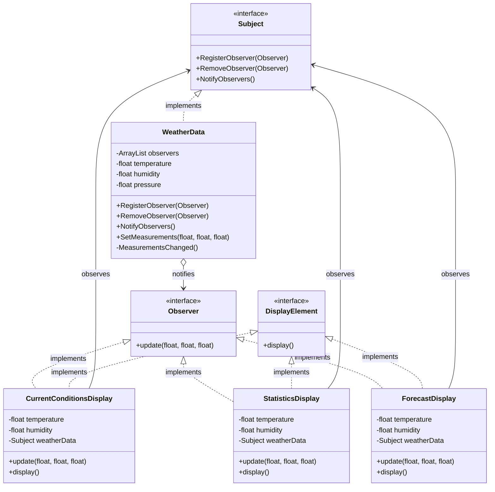
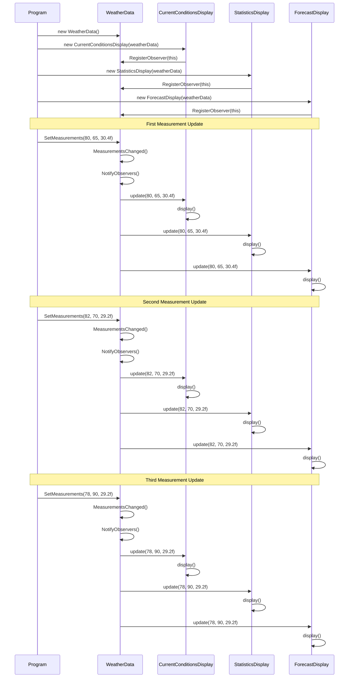

# Observer Pattern - Weather Monitoring System

A C# implementation of the Observer Design Pattern demonstrating a weather monitoring system where multiple display elements observe and react to weather data changes.

## Overview

This project demonstrates the Observer pattern, a behavioral design pattern that establishes a one-to-many dependency between objects. When the subject (WeatherData) changes state, all registered observers (display elements) are automatically notified and updated.

## Pattern Structure

### Interfaces

- **Subject**: Defines methods for registering, removing, and notifying observers
- **Observer**: Defines the update method that observers must implement
- **DisplayElement**: Defines the display method for presenting information

### Components

#### Subject
- **WeatherData**: Maintains weather measurements (temperature, humidity, pressure) and manages observer subscriptions

#### Observers
- **CurrentConditionsDisplay**: Displays current weather conditions
- **StatisticsDisplay**: Shows weather statistics
- **ForecastDisplay**: Presents weather forecast information

## How It Works

1. Observer objects register themselves with the WeatherData subject
2. When weather measurements change via `SetMeasurements()`, the subject notifies all registered observers
3. Each observer receives updated data through the `update()` method
4. Observers automatically display the new information

## Class Diagram



## Program Flow



## Project Structure

```
ObserverPattern/
??? Interfaces/
?   ??? Subject.cs
?   ??? Observer.cs
?   ??? DisplayElement.cs
??? Subjects/
?   ??? WeatherData.cs
??? Observers/
?   ??? CurrentConditionsDisplay.cs
?   ??? StatisticsDisplay.cs
?   ??? ForecastDisplay.cs
??? Program.cs
```

## Usage Example

```csharp
// Create the subject
WeatherData weatherData = new WeatherData();

// Create and register observers
CurrentConditionsDisplay currentDisplay = new CurrentConditionsDisplay(weatherData);
StatisticsDisplay statisticsDisplay = new StatisticsDisplay(weatherData);
ForecastDisplay forecastDisplay = new ForecastDisplay(weatherData);

// Update measurements - all observers are automatically notified
weatherData.SetMeasurements(80, 65, 30.4f);
weatherData.SetMeasurements(82, 70, 29.2f);
weatherData.SetMeasurements(78, 90, 29.2f);
```

## Output

```
Current conditions: 80F degrees and 65% humidity
Statistics: 80F degrees and 65% humidity
Forecast: 80F degrees and 65% humidity
Current conditions: 82F degrees and 70% humidity
Statistics: 82F degrees and 70% humidity
Forecast: 82F degrees and 70% humidity
Current conditions: 78F degrees and 90% humidity
Statistics: 78F degrees and 90% humidity
Forecast: 78F degrees and 90% humidity
```

## Requirements

- .NET 8.0
- C# 12.0 or later

## Key Benefits

- **Loose Coupling**: Subject and observers are loosely coupled and can vary independently
- **Dynamic Relationships**: Observers can be added or removed at runtime
- **Broadcast Communication**: Subject broadcasts changes to all interested observers
- **Open/Closed Principle**: New observer types can be added without modifying the subject

## Design Principles Applied

- Program to interfaces, not implementations
- Strive for loosely coupled designs between objects that interact
- Classes should be open for extension but closed for modification